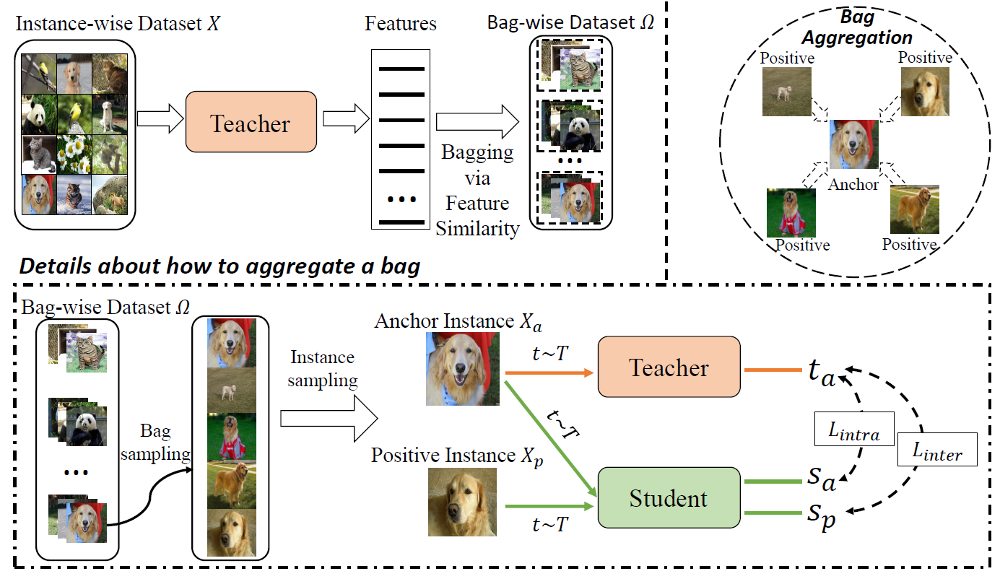
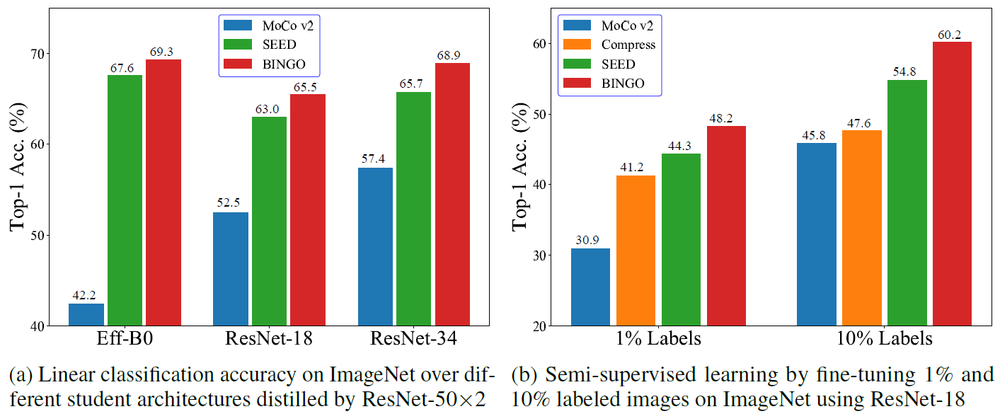
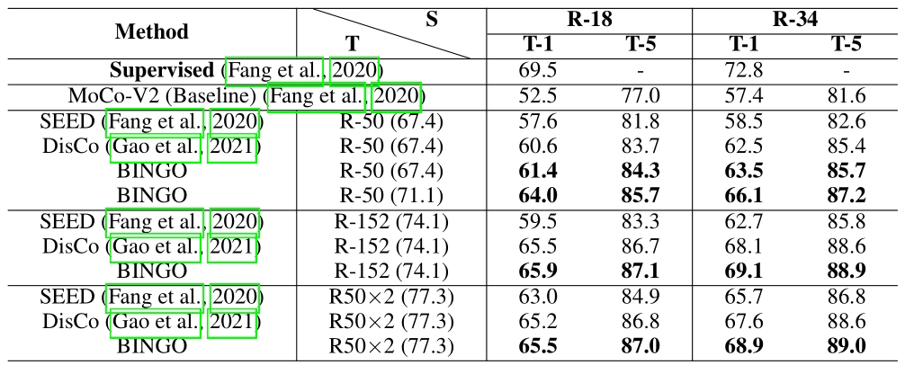
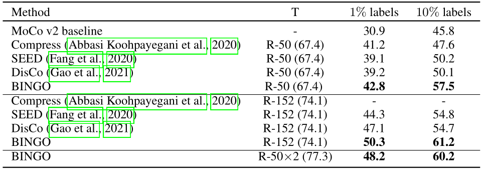

# Bag of Instances Aggregation Boosts Self-supervised Learning

Official implementation of the paper [Bag of Instances Aggregation Boosts Self-supervised Distillation](https://arxiv.org/abs/2107.01691),  
by [Haohang Xu](https://www.semanticscholar.org/author/Haohang-Xu/1418682427)\*, [Jiemin Fang](https://jaminfong.cn/)*, [Xiaopeng Zhang](https://sites.google.com/site/zxphistory/), [Lingxi Xie](http://lingxixie.com/), [Xinggang Wang](https://xinggangw.info/), [Wenrui Dai](https://scholar.google.com/citations?user=Xg8MhyAAAAAJ&hl=en), [Hongkai Xiong](https://scholar.google.com/citations?user=bB16iN4AAAAJ&hl=en), [Qi Tian](https://scholar.google.com/citations?hl=en&user=61b6eYkAAAAJ).

Recent advances in self-supervised learning have experienced remarkable progress, especially for contrastive learning based methods, which regard each image as well as its augmentations as an individual class and try to distinguish them from all other images. However, due to the large quantity of exemplars, this kind of pretext task intrinsically suffers from slow convergence and is hard for optimization. This is especially true for small scale models, which we find the performance drops dramatically comparing with its supervised counterpart. In this paper, we propose a simple but effective distillation strategy for unsupervised learning. The highlight is that the relationship among similar samples counts and can be seamlessly transferred to the student to boost the performance. Our method, termed as BINGO, which is short for **B**ag of **I**nsta**N**ces a**G**gregati**O**n, targets at transferring the relationship learned by the teacher to the student. Here bag of instances indicates a set of similar samples constructed by the teacher and are grouped within a bag, and the goal of distillation is to aggregate compact representations over the student with respect to instances in a bag. Notably, BINGO achieves new state-of-the-art performance on small scale models, i.e., 65.5% and 68.9% top-1 accuracies with linear evaluation on ImageNet, using ResNet-18 and ResNet-34 as backbone, respectively, surpassing baselines (52.5% and 57.4% top-1 accuracies) by a significant margin. 


<div  align="center">

</div>

## Requirements
* Pytorch >= 1.4.0
* faiss-gpu
* absl-py

## Unsupervised Training
### Data-Relation Extract
```
bash run_knn.sh # change --data_dir --ckpt_name --corr_name with the path in your server
```
### Distillation
```
# Distill Efficentnet
bash scripts/unsupervised/SEffB0-TR50W2.sh

# Distill ResNet
# change --t_arch, --s_arch to run with different teacher and student networks
# change --pretrain_path, --data_dir, --corr_npy with the path in your server
# Note that --corr_npy need to be consist with --corr_name in run_knn.sh
bash scripts/unsupervised/SR18-TR50W2.sh
bash scripts/unsupervised/SR18-TR50.sh
```


## Linear Classification
```
# Evaluate EfficientNet
bash scripts/lincls/Eff.sh

# Evaluate ResNet
bash scripts/lincls/Res.sh
```

## Performance
<div  align="center">

</div>
**Linear evaluation accuracy on ImageNet**

<div  align="center">

</div>
**Semi-supervised learning on ImageNet with ResNet-18**

<div  align="center">    

</div>


## Citation
If you find this repository/work helpful in your research, welcome to cite the paper.
```
@inproceedings{bingo,
    title={Bag of Instances Aggregation Boosts Self-supervised Distillation}, 
    author={Haohang Xu and Jiemin Fang and Xiaopeng Zhang and Lingxi Xie and Xinggang Wang and Wenrui Dai and Hongkai Xiong and Qi Tian},
    journal={International Conference on Learning Representations},
    year={2022}
}
